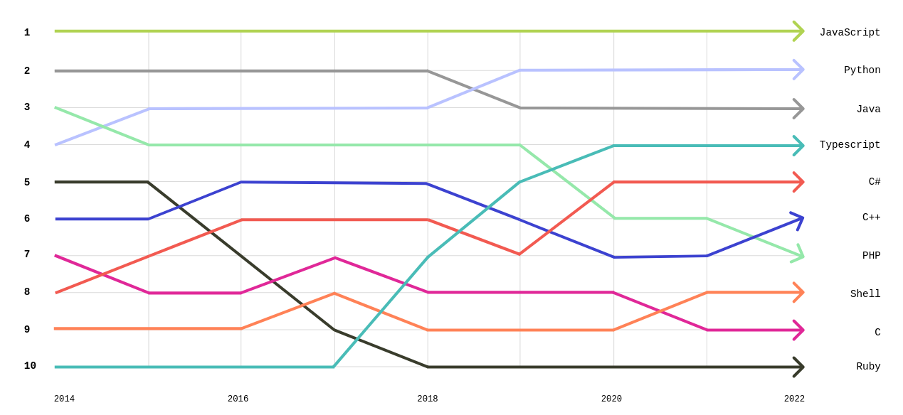

<!--

author: André Dietrich

@embed: <iframe src="https://api.allorigins.win/raw?url=@0" style="width: 100%; height: 60vh;"></iframe>

language: de

narrator: Deutsch Female

-->


# Dein Browser das unbekannte Wesen


## Internet

<div style="width:100%;height:0;padding-bottom:76%;position:relative;"><iframe src="https://giphy.com/embed/fxO5urhnGImBuYtph7" width="100%" height="100%" style="position:absolute" frameBorder="0" class="giphy-embed" allowFullScreen></iframe></div><p><a href="https://giphy.com/gifs/internet-cyberspace-surfing-the-net-fxO5urhnGImBuYtph7">via GIPHY</a></p>

### Ursprung - ARPANET


### World Wide Web


    {{1}}


    {{2}}
<section>

Bis Weihnachten 1990 hatte Berners-Lee alle erforderlichen Werkzeuge für ein funktionierendes Web entwickelt:

* das HyperText Transfer Protocol (HTTP) 0.9
* die HyperText Markup Language (HTML)
* den ersten Webbrowser (der auch ein HTML-Editor war und auf Usenet-Newsgroups und FTP-Dateien zugreifen konnte)

      {{3}}
  

* die erste HTTP-Server-Software (später bekannt als CERN httpd)
* den ersten Webserver
* und die ersten Webseiten, die das Projekt selbst beschrieben

</section>

    {{4}}
> Die Stanford Federal Credit Union war im Oktober 1994 die erste Finanzinstitution, die ihren Mitgliedern Online-Banking-Dienste über das Internet anbot.

    {{5}}
> Bis 1995 war das Internet in den USA vollständig kommerzialisiert, als das NSFNet außer Betrieb genommen wurde und damit die letzten Beschränkungen für die Nutzung des Internets zur Beförderung von kommerziellem Verkehr aufgehoben wurden.


### Das Internet heute


    {{1}}
[The Internet Map](http://internet-map.net)


## JavaScript


> JavaScript ist eine ___high-level___, oft ___just-in-time kompilierte___ Sprache, die dem ECMAScript-Standard entspricht. Sie verfügt über ___dynamische Typisierung___, ___prototypenbasierte Objektorientierung___ und ___Funktionen als Erstklassige Objekte___. Sie ist ___mehrparadigmatisch___ und unterstützt ___ereignisgesteuerte___, ___funktionale___ und ___imperative Programmierungsstile___. Sie verfügt über Anwendungsprogrammierschnittstellen (APIs) zum Arbeiten mit Text, Datum, regulären Ausdrücken, standardmäßigen Datenstrukturen und dem Dokumentenobjektmodell (DOM).
>
> Quelle: [Wikipedia](https://de.wikipedia.org/wiki/JavaScript)

    {{1}}
__September 1995:__
Als Betaversion veröffentlicht im Netscape Navigator

    {{2}}
__August 1996:__
Veröffentlichung von JScript im Microsoft Internet Explorer 3.0 _(Reverse-Engineered von Netscape)_

    {{3}}
__November 1996:__
Netscape reichte JavaScript bei Ecma International ein, als Ausgangspunkt für eine Standard-Spezifikation

    {{4}}
__Juni 1997:__
Offizielle Veröffentlichung der ersten ECMAScript-Sprachspezifikation
 

### Verbreitung

<!-- data-show
data-type="barchart"
data-title="Verbreitung von Programmiersprachen bei Entwicklern"-->
| Programmiersprache      | Anteil in % |
| ----------------------- | -----------:|
| JavaScript              |       63.61 |
| HTML/CSS                |       52.97 |
| Python                  |       49.28 |
| SQL                     |       48.66 |
| TypeScript              |       38.87 |
| Bash/Shell (all shells) |       32.37 |
| Java                    |       30.55 |
| C#                      |       27.62 |
| C++                     |       22.42 |
| C                       |       19.34 |
| PHP                     |       18.58 |
| PowerShell              |       13.59 |
| Go                      |       13.24 |
| Rust                    |       13.05 |
| Kotlin                  |        9.06 |
| Ruby                    |        6.23 |
| Lua                     |        6.09 |
| Dart                    |        6.02 |
| Assembly                |        5.43 |
| Swift                   |        4.65 |
| R                       |        4.23 |
| Visual Basic (.Net)     |        4.07 |
| MATLAB                  |        3.81 |
| VBA                     |        3.55 |
| Groovy                  |        3.40 |
| Delphi                  |        3.23 |
| Scala                   |        2.77 |
| Perl                    |        2.46 |
| Elixir                  |        2.32 |
| Objective-C             |        2.31 |
| Haskell                 |        2.09 |
| GDScript                |        1.71 |
| Lisp                    |        1.53 |
| Solidity                |        1.33 |
| Clojure                 |        1.26 |
| Julia                   |        1.15 |
| Erlang                  |        0.99 |
| F#                      |        0.97 |
| Fortran                 |        0.95 |
| Prolog                  |        0.89 |
| Zig                     |        0.83 |
| Ada                     |        0.77 |
| OCaml                   |        0.70 |
| Apex                    |        0.66 |
| Cobol                   |        0.66 |
| SAS                     |        0.49 |
| Crystal                 |        0.44 |
| Nim                     |        0.38 |
| APL                     |        0.26 |
| Flow                    |        0.24 |
| Raku                    |        0.18 |

Quelle: https://www.statista.com/statistics/793628/worldwide-developer-survey-most-used-languages/

---

    {{1}}


### Taschenrechner

Öffnen der Konsole: 
<kbd>Strg</kbd> + <kbd>Shift</kbd> + <kbd>i</kbd>

``` js
var x = 22
2000 + (30.1 * x) ** 3
```
<script>@input</script>


### Sensor API

``` js
function handleOrientation(event) {
  let alpha = event.alpha; // Z-axis rotation (0-360 degrees)
  let beta = event.beta;   // Front-back rotation (-180 to  180 degrees)
  let gamma = event.gamma; // Left-right tilt (-90 to  90 degrees)

  console.log(`Alpha: ${alpha}`);
  console.log(`Beta: ${beta}`);
  console.log(`Gamma: ${gamma}`);
}

window.addEventListener('deviceorientation', handleOrientation);
```
<script>
@input

send.handle("stop", () => {
  window.removeEventListener('deviceorientation', handleOrientation);
})

"LIA: terminal"
</script>

#### Demo
<!--
persistent: true
-->

<video autoplay="false" id="videoElement" style="width: 100%"></video>

<script>
var video = document.querySelector("#videoElement");

if (navigator.mediaDevices.getUserMedia) {
 navigator.mediaDevices.getUserMedia({ video: true })
    .then(function (stream) {
      video.srcObject = stream;
    })
    .catch(function (err0r) {
      console.log("Something went wrong!");
    });
}
console.log("Accessing the cam")
</script>

### Geolocation

``` js
function successCallback(position) {
  var latitude = position.coords.latitude;
  var longitude = position.coords.longitude;
  console.log("Latitude: " + latitude + ", Longitude: " + longitude);
}

function errorCallback(error) {
  console.log("Error Code = " + error.code + " - " + error.message);
}

navigator.geolocation.getCurrentPosition(successCallback, errorCallback);
```
<script>@input</script>

### Fetching Data

``` js
fetch("https://api.open-meteo.com/v1/forecast?latitude=50.92558&longitude=13.33125&hourly=temperature_2m")
    .then(response => response.json())
    .then(data => {
        let table = "| Time | Temperature |\n"
        table += "| ---- | ----------- |\n"

        for(let i=0; i < data.hourly.time.length; i++) {
            table += "| " + data.hourly.time[i] + " | " + data.hourly.temperature_2m[i] + " |\n"
        }

        console.log(table)
    })
    .catch(e => {
        send.lia("ups, something went wrong")
    })

"waiting for the weather"
```
<script>@input</script>


### WebGL


``` js
'use strict';

const canvas = document.getElementsByTagName('canvas')[0];
canvas.width = canvas.clientWidth;
canvas.height = canvas.clientHeight;

let config = {
    TEXTURE_DOWNSAMPLE: 1,
    DENSITY_DISSIPATION: 0.98,
    VELOCITY_DISSIPATION: 0.99,
    PRESSURE_DISSIPATION: 0.8,
    PRESSURE_ITERATIONS: 25,
    CURL: 30,
    SPLAT_RADIUS: 0.005
}

let pointers = [];
let splatStack = [];

const {
    gl,
    ext
} = getWebGLContext(canvas);

function getWebGLContext(canvas) {
    const params = {
        alpha: false,
        depth: false,
        stencil: false,
        antialias: false
    };

    let gl = canvas.getContext('webgl2', params);
    const isWebGL2 = !!gl;
    if (!isWebGL2)
        gl = canvas.getContext('webgl', params) || canvas.getContext('experimental-webgl', params);

    let halfFloat;
    let supportLinearFiltering;
    if (isWebGL2) {
        gl.getExtension('EXT_color_buffer_float');
        supportLinearFiltering = gl.getExtension('OES_texture_float_linear');
    } else {
        halfFloat = gl.getExtension('OES_texture_half_float');
        supportLinearFiltering = gl.getExtension('OES_texture_half_float_linear');
    }

    gl.clearColor(0.0, 0.0, 0.0, 1.0);

    const halfFloatTexType = isWebGL2 ? gl.HALF_FLOAT : halfFloat.HALF_FLOAT_OES;
    let formatRGBA;
    let formatRG;
    let formatR;

    if (isWebGL2) {
        formatRGBA = getSupportedFormat(gl, gl.RGBA16F, gl.RGBA, halfFloatTexType);
        formatRG = getSupportedFormat(gl, gl.RG16F, gl.RG, halfFloatTexType);
        formatR = getSupportedFormat(gl, gl.R16F, gl.RED, halfFloatTexType);
    } else {
        formatRGBA = getSupportedFormat(gl, gl.RGBA, gl.RGBA, halfFloatTexType);
        formatRG = getSupportedFormat(gl, gl.RGBA, gl.RGBA, halfFloatTexType);
        formatR = getSupportedFormat(gl, gl.RGBA, gl.RGBA, halfFloatTexType);
    }

    return {
        gl,
        ext: {
            formatRGBA,
            formatRG,
            formatR,
            halfFloatTexType,
            supportLinearFiltering
        }
    };
}

function getSupportedFormat(gl, internalFormat, format, type) {
    if (!supportRenderTextureFormat(gl, internalFormat, format, type)) {
        switch (internalFormat) {
            case gl.R16F:
                return getSupportedFormat(gl, gl.RG16F, gl.RG, type);
            case gl.RG16F:
                return getSupportedFormat(gl, gl.RGBA16F, gl.RGBA, type);
            default:
                return null;
        }
    }

    return {
        internalFormat,
        format
    }
}

function supportRenderTextureFormat(gl, internalFormat, format, type) {
    let texture = gl.createTexture();
    gl.bindTexture(gl.TEXTURE_2D, texture);
    gl.texParameteri(gl.TEXTURE_2D, gl.TEXTURE_MIN_FILTER, gl.NEAREST);
    gl.texParameteri(gl.TEXTURE_2D, gl.TEXTURE_MAG_FILTER, gl.NEAREST);
    gl.texParameteri(gl.TEXTURE_2D, gl.TEXTURE_WRAP_S, gl.CLAMP_TO_EDGE);
    gl.texParameteri(gl.TEXTURE_2D, gl.TEXTURE_WRAP_T, gl.CLAMP_TO_EDGE);
    gl.texImage2D(gl.TEXTURE_2D, 0, internalFormat, 4, 4, 0, format, type, null);

    let fbo = gl.createFramebuffer();
    gl.bindFramebuffer(gl.FRAMEBUFFER, fbo);
    gl.framebufferTexture2D(gl.FRAMEBUFFER, gl.COLOR_ATTACHMENT0, gl.TEXTURE_2D, texture, 0);

    const status = gl.checkFramebufferStatus(gl.FRAMEBUFFER);
    if (status != gl.FRAMEBUFFER_COMPLETE)
        return false;
    return true;
}

function pointerPrototype() {
    this.id = -1;
    this.x = 0;
    this.y = 0;
    this.dx = 0;
    this.dy = 0;
    this.down = false;
    this.moved = false;
    this.color = [30, 0, 300];
}

pointers.push(new pointerPrototype());

class GLProgram {
    constructor(vertexShader, fragmentShader) {
        this.uniforms = {};
        this.program = gl.createProgram();

        gl.attachShader(this.program, vertexShader);
        gl.attachShader(this.program, fragmentShader);
        gl.linkProgram(this.program);

        if (!gl.getProgramParameter(this.program, gl.LINK_STATUS))
            throw gl.getProgramInfoLog(this.program);

        const uniformCount = gl.getProgramParameter(this.program, gl.ACTIVE_UNIFORMS);
        for (let i = 0; i < uniformCount; i++) {
            const uniformName = gl.getActiveUniform(this.program, i).name;
            this.uniforms[uniformName] = gl.getUniformLocation(this.program, uniformName);
        }
    }

    bind() {
        gl.useProgram(this.program);
    }
}

function compileShader(type, source) {
    const shader = gl.createShader(type);
    gl.shaderSource(shader, source);
    gl.compileShader(shader);

    if (!gl.getShaderParameter(shader, gl.COMPILE_STATUS))
        throw gl.getShaderInfoLog(shader);

    return shader;
};

const baseVertexShader = compileShader(gl.VERTEX_SHADER, `
    precision highp float;
    precision mediump sampler2D;

    attribute vec2 aPosition;
    varying vec2 vUv;
    varying vec2 vL;
    varying vec2 vR;
    varying vec2 vT;
    varying vec2 vB;
    uniform vec2 texelSize;

    void main () {
        vUv = aPosition * 0.5 + 0.5;
        vL = vUv - vec2(texelSize.x, 0.0);
        vR = vUv + vec2(texelSize.x, 0.0);
        vT = vUv + vec2(0.0, texelSize.y);
        vB = vUv - vec2(0.0, texelSize.y);
        gl_Position = vec4(aPosition, 0.0, 1.0);
    }
`);

const clearShader = compileShader(gl.FRAGMENT_SHADER, `
    precision highp float;
    precision mediump sampler2D;

    varying vec2 vUv;
    uniform sampler2D uTexture;
    uniform float value;

    void main () {
        gl_FragColor = value * texture2D(uTexture, vUv);
    }
`);

const displayShader = compileShader(gl.FRAGMENT_SHADER, `
    precision highp float;
    precision mediump sampler2D;

    varying vec2 vUv;
    uniform sampler2D uTexture;

    void main () {
        gl_FragColor = texture2D(uTexture, vUv);
    }
`);

const splatShader = compileShader(gl.FRAGMENT_SHADER, `
    precision highp float;
    precision mediump sampler2D;

    varying vec2 vUv;
    uniform sampler2D uTarget;
    uniform float aspectRatio;
    uniform vec3 color;
    uniform vec2 point;
    uniform float radius;

    void main () {
        vec2 p = vUv - point.xy;
        p.x *= aspectRatio;
        vec3 splat = exp(-dot(p, p) / radius) * color;
        vec3 base = texture2D(uTarget, vUv).xyz;
        gl_FragColor = vec4(base + splat, 1.0);
    }
`);

const advectionManualFilteringShader = compileShader(gl.FRAGMENT_SHADER, `
    precision highp float;
    precision mediump sampler2D;

    varying vec2 vUv;
    uniform sampler2D uVelocity;
    uniform sampler2D uSource;
    uniform vec2 texelSize;
    uniform float dt;
    uniform float dissipation;

    vec4 bilerp (in sampler2D sam, in vec2 p) {
        vec4 st;
        st.xy = floor(p - 0.5) + 0.5;
        st.zw = st.xy + 1.0;
        vec4 uv = st * texelSize.xyxy;
        vec4 a = texture2D(sam, uv.xy);
        vec4 b = texture2D(sam, uv.zy);
        vec4 c = texture2D(sam, uv.xw);
        vec4 d = texture2D(sam, uv.zw);
        vec2 f = p - st.xy;
        return mix(mix(a, b, f.x), mix(c, d, f.x), f.y);
    }

    void main () {
        vec2 coord = gl_FragCoord.xy - dt * texture2D(uVelocity, vUv).xy;
        gl_FragColor = dissipation * bilerp(uSource, coord);
        gl_FragColor.a = 1.0;
    }
`);

const advectionShader = compileShader(gl.FRAGMENT_SHADER, `
    precision highp float;
    precision mediump sampler2D;

    varying vec2 vUv;
    uniform sampler2D uVelocity;
    uniform sampler2D uSource;
    uniform vec2 texelSize;
    uniform float dt;
    uniform float dissipation;

    void main () {
        vec2 coord = vUv - dt * texture2D(uVelocity, vUv).xy * texelSize;
        gl_FragColor = dissipation * texture2D(uSource, coord);
        gl_FragColor.a = 1.0;
    }
`);

const divergenceShader = compileShader(gl.FRAGMENT_SHADER, `
    precision highp float;
    precision mediump sampler2D;

    varying vec2 vUv;
    varying vec2 vL;
    varying vec2 vR;
    varying vec2 vT;
    varying vec2 vB;
    uniform sampler2D uVelocity;

    vec2 sampleVelocity (in vec2 uv) {
        vec2 multiplier = vec2(1.0, 1.0);
        if (uv.x < 0.0) { uv.x = 0.0; multiplier.x = -1.0; }
        if (uv.x > 1.0) { uv.x = 1.0; multiplier.x = -1.0; }
        if (uv.y < 0.0) { uv.y = 0.0; multiplier.y = -1.0; }
        if (uv.y > 1.0) { uv.y = 1.0; multiplier.y = -1.0; }
        return multiplier * texture2D(uVelocity, uv).xy;
    }

    void main () {
        float L = sampleVelocity(vL).x;
        float R = sampleVelocity(vR).x;
        float T = sampleVelocity(vT).y;
        float B = sampleVelocity(vB).y;
        float div = 0.5 * (R - L + T - B);
        gl_FragColor = vec4(div, 0.0, 0.0, 1.0);
    }
`);

const curlShader = compileShader(gl.FRAGMENT_SHADER, `
    precision highp float;
    precision mediump sampler2D;

    varying vec2 vUv;
    varying vec2 vL;
    varying vec2 vR;
    varying vec2 vT;
    varying vec2 vB;
    uniform sampler2D uVelocity;

    void main () {
        float L = texture2D(uVelocity, vL).y;
        float R = texture2D(uVelocity, vR).y;
        float T = texture2D(uVelocity, vT).x;
        float B = texture2D(uVelocity, vB).x;
        float vorticity = R - L - T + B;
        gl_FragColor = vec4(vorticity, 0.0, 0.0, 1.0);
    }
`);

const vorticityShader = compileShader(gl.FRAGMENT_SHADER, `
    precision highp float;
    precision mediump sampler2D;

    varying vec2 vUv;
    varying vec2 vT;
    varying vec2 vB;
    uniform sampler2D uVelocity;
    uniform sampler2D uCurl;
    uniform float curl;
    uniform float dt;

    void main () {
        float T = texture2D(uCurl, vT).x;
        float B = texture2D(uCurl, vB).x;
        float C = texture2D(uCurl, vUv).x;
        vec2 force = vec2(abs(T) - abs(B), 0.0);
        force *= 1.0 / length(force + 0.00001) * curl * C;
        vec2 vel = texture2D(uVelocity, vUv).xy;
        gl_FragColor = vec4(vel + force * dt, 0.0, 1.0);
    }
`);

const pressureShader = compileShader(gl.FRAGMENT_SHADER, `
    precision highp float;
    precision mediump sampler2D;

    varying vec2 vUv;
    varying vec2 vL;
    varying vec2 vR;
    varying vec2 vT;
    varying vec2 vB;
    uniform sampler2D uPressure;
    uniform sampler2D uDivergence;

    vec2 boundary (in vec2 uv) {
        uv = min(max(uv, 0.0), 1.0);
        return uv;
    }

    void main () {
        float L = texture2D(uPressure, boundary(vL)).x;
        float R = texture2D(uPressure, boundary(vR)).x;
        float T = texture2D(uPressure, boundary(vT)).x;
        float B = texture2D(uPressure, boundary(vB)).x;
        float C = texture2D(uPressure, vUv).x;
        float divergence = texture2D(uDivergence, vUv).x;
        float pressure = (L + R + B + T - divergence) * 0.25;
        gl_FragColor = vec4(pressure, 0.0, 0.0, 1.0);
    }
`);

const gradientSubtractShader = compileShader(gl.FRAGMENT_SHADER, `
    precision highp float;
    precision mediump sampler2D;

    varying vec2 vUv;
    varying vec2 vL;
    varying vec2 vR;
    varying vec2 vT;
    varying vec2 vB;
    uniform sampler2D uPressure;
    uniform sampler2D uVelocity;

    vec2 boundary (in vec2 uv) {
        uv = min(max(uv, 0.0), 1.0);
        return uv;
    }

    void main () {
        float L = texture2D(uPressure, boundary(vL)).x;
        float R = texture2D(uPressure, boundary(vR)).x;
        float T = texture2D(uPressure, boundary(vT)).x;
        float B = texture2D(uPressure, boundary(vB)).x;
        vec2 velocity = texture2D(uVelocity, vUv).xy;
        velocity.xy -= vec2(R - L, T - B);
        gl_FragColor = vec4(velocity, 0.0, 1.0);
    }
`);

let textureWidth;
let textureHeight;
let density;
let velocity;
let divergence;
let curl;
let pressure;
initFramebuffers();

const clearProgram = new GLProgram(baseVertexShader, clearShader);
const displayProgram = new GLProgram(baseVertexShader, displayShader);
const splatProgram = new GLProgram(baseVertexShader, splatShader);
const advectionProgram = new GLProgram(baseVertexShader, ext.supportLinearFiltering ? advectionShader : advectionManualFilteringShader);
const divergenceProgram = new GLProgram(baseVertexShader, divergenceShader);
const curlProgram = new GLProgram(baseVertexShader, curlShader);
const vorticityProgram = new GLProgram(baseVertexShader, vorticityShader);
const pressureProgram = new GLProgram(baseVertexShader, pressureShader);
const gradienSubtractProgram = new GLProgram(baseVertexShader, gradientSubtractShader);

function initFramebuffers() {
    textureWidth = gl.drawingBufferWidth >> config.TEXTURE_DOWNSAMPLE;
    textureHeight = gl.drawingBufferHeight >> config.TEXTURE_DOWNSAMPLE;

    const texType = ext.halfFloatTexType;
    const rgba = ext.formatRGBA;
    const rg = ext.formatRG;
    const r = ext.formatR;

    density = createDoubleFBO(2, textureWidth, textureHeight, rgba.internalFormat, rgba.format, texType, ext.supportLinearFiltering ? gl.LINEAR : gl.NEAREST);
    velocity = createDoubleFBO(0, textureWidth, textureHeight, rg.internalFormat, rg.format, texType, ext.supportLinearFiltering ? gl.LINEAR : gl.NEAREST);
    divergence = createFBO(4, textureWidth, textureHeight, r.internalFormat, r.format, texType, gl.NEAREST);
    curl = createFBO(5, textureWidth, textureHeight, r.internalFormat, r.format, texType, gl.NEAREST);
    pressure = createDoubleFBO(6, textureWidth, textureHeight, r.internalFormat, r.format, texType, gl.NEAREST);
}

function createFBO(texId, w, h, internalFormat, format, type, param) {
    gl.activeTexture(gl.TEXTURE0 + texId);
    let texture = gl.createTexture();
    gl.bindTexture(gl.TEXTURE_2D, texture);
    gl.texParameteri(gl.TEXTURE_2D, gl.TEXTURE_MIN_FILTER, param);
    gl.texParameteri(gl.TEXTURE_2D, gl.TEXTURE_MAG_FILTER, param);
    gl.texParameteri(gl.TEXTURE_2D, gl.TEXTURE_WRAP_S, gl.CLAMP_TO_EDGE);
    gl.texParameteri(gl.TEXTURE_2D, gl.TEXTURE_WRAP_T, gl.CLAMP_TO_EDGE);
    gl.texImage2D(gl.TEXTURE_2D, 0, internalFormat, w, h, 0, format, type, null);

    let fbo = gl.createFramebuffer();
    gl.bindFramebuffer(gl.FRAMEBUFFER, fbo);
    gl.framebufferTexture2D(gl.FRAMEBUFFER, gl.COLOR_ATTACHMENT0, gl.TEXTURE_2D, texture, 0);
    gl.viewport(0, 0, w, h);
    gl.clear(gl.COLOR_BUFFER_BIT);

    return [texture, fbo, texId];
}

function createDoubleFBO(texId, w, h, internalFormat, format, type, param) {
    let fbo1 = createFBO(texId, w, h, internalFormat, format, type, param);
    let fbo2 = createFBO(texId + 1, w, h, internalFormat, format, type, param);

    return {
        get read() {
            return fbo1;
        },
        get write() {
            return fbo2;
        },
        swap() {
            let temp = fbo1;
            fbo1 = fbo2;
            fbo2 = temp;
        }
    }
}

const blit = (() => {
    gl.bindBuffer(gl.ARRAY_BUFFER, gl.createBuffer());
    gl.bufferData(gl.ARRAY_BUFFER, new Float32Array([-1, -1, -1, 1, 1, 1, 1, -1]), gl.STATIC_DRAW);
    gl.bindBuffer(gl.ELEMENT_ARRAY_BUFFER, gl.createBuffer());
    gl.bufferData(gl.ELEMENT_ARRAY_BUFFER, new Uint16Array([0, 1, 2, 0, 2, 3]), gl.STATIC_DRAW);
    gl.vertexAttribPointer(0, 2, gl.FLOAT, false, 0, 0);
    gl.enableVertexAttribArray(0);

    return (destination) => {
        gl.bindFramebuffer(gl.FRAMEBUFFER, destination);
        gl.drawElements(gl.TRIANGLES, 6, gl.UNSIGNED_SHORT, 0);
    }
})();

let lastTime = Date.now();
multipleSplats(parseInt(Math.random() * 20) + 5);
update();

function update() {
    resizeCanvas();

    const dt = Math.min((Date.now() - lastTime) / 1000, 0.016);
    lastTime = Date.now();

    gl.viewport(0, 0, textureWidth, textureHeight);

    if (splatStack.length > 0)
        multipleSplats(splatStack.pop());

    advectionProgram.bind();
    gl.uniform2f(advectionProgram.uniforms.texelSize, 1.0 / textureWidth, 1.0 / textureHeight);
    gl.uniform1i(advectionProgram.uniforms.uVelocity, velocity.read[2]);
    gl.uniform1i(advectionProgram.uniforms.uSource, velocity.read[2]);
    gl.uniform1f(advectionProgram.uniforms.dt, dt);
    gl.uniform1f(advectionProgram.uniforms.dissipation, config.VELOCITY_DISSIPATION);
    blit(velocity.write[1]);
    velocity.swap();

    gl.uniform1i(advectionProgram.uniforms.uVelocity, velocity.read[2]);
    gl.uniform1i(advectionProgram.uniforms.uSource, density.read[2]);
    gl.uniform1f(advectionProgram.uniforms.dissipation, config.DENSITY_DISSIPATION);
    blit(density.write[1]);
    density.swap();

    for (let i = 0; i < pointers.length; i++) {
        const pointer = pointers[i];
        if (pointer.moved) {
            splat(pointer.x, pointer.y, pointer.dx, pointer.dy, pointer.color);
            pointer.moved = false;
        }
    }

    curlProgram.bind();
    gl.uniform2f(curlProgram.uniforms.texelSize, 1.0 / textureWidth, 1.0 / textureHeight);
    gl.uniform1i(curlProgram.uniforms.uVelocity, velocity.read[2]);
    blit(curl[1]);

    vorticityProgram.bind();
    gl.uniform2f(vorticityProgram.uniforms.texelSize, 1.0 / textureWidth, 1.0 / textureHeight);
    gl.uniform1i(vorticityProgram.uniforms.uVelocity, velocity.read[2]);
    gl.uniform1i(vorticityProgram.uniforms.uCurl, curl[2]);
    gl.uniform1f(vorticityProgram.uniforms.curl, config.CURL);
    gl.uniform1f(vorticityProgram.uniforms.dt, dt);
    blit(velocity.write[1]);
    velocity.swap();

    divergenceProgram.bind();
    gl.uniform2f(divergenceProgram.uniforms.texelSize, 1.0 / textureWidth, 1.0 / textureHeight);
    gl.uniform1i(divergenceProgram.uniforms.uVelocity, velocity.read[2]);
    blit(divergence[1]);

    clearProgram.bind();
    let pressureTexId = pressure.read[2];
    gl.activeTexture(gl.TEXTURE0 + pressureTexId);
    gl.bindTexture(gl.TEXTURE_2D, pressure.read[0]);
    gl.uniform1i(clearProgram.uniforms.uTexture, pressureTexId);
    gl.uniform1f(clearProgram.uniforms.value, config.PRESSURE_DISSIPATION);
    blit(pressure.write[1]);
    pressure.swap();

    pressureProgram.bind();
    gl.uniform2f(pressureProgram.uniforms.texelSize, 1.0 / textureWidth, 1.0 / textureHeight);
    gl.uniform1i(pressureProgram.uniforms.uDivergence, divergence[2]);
    pressureTexId = pressure.read[2];
    gl.uniform1i(pressureProgram.uniforms.uPressure, pressureTexId);
    gl.activeTexture(gl.TEXTURE0 + pressureTexId);
    for (let i = 0; i < config.PRESSURE_ITERATIONS; i++) {
        gl.bindTexture(gl.TEXTURE_2D, pressure.read[0]);
        blit(pressure.write[1]);
        pressure.swap();
    }

    gradienSubtractProgram.bind();
    gl.uniform2f(gradienSubtractProgram.uniforms.texelSize, 1.0 / textureWidth, 1.0 / textureHeight);
    gl.uniform1i(gradienSubtractProgram.uniforms.uPressure, pressure.read[2]);
    gl.uniform1i(gradienSubtractProgram.uniforms.uVelocity, velocity.read[2]);
    blit(velocity.write[1]);
    velocity.swap();

    gl.viewport(0, 0, gl.drawingBufferWidth, gl.drawingBufferHeight);
    displayProgram.bind();
    gl.uniform1i(displayProgram.uniforms.uTexture, density.read[2]);
    blit(null);

    requestAnimationFrame(update);
}

function splat(x, y, dx, dy, color) {
    splatProgram.bind();
    gl.uniform1i(splatProgram.uniforms.uTarget, velocity.read[2]);
    gl.uniform1f(splatProgram.uniforms.aspectRatio, canvas.width / canvas.height);
    gl.uniform2f(splatProgram.uniforms.point, x / canvas.width, 1.0 - y / canvas.height);
    gl.uniform3f(splatProgram.uniforms.color, dx, -dy, 1.0);
    gl.uniform1f(splatProgram.uniforms.radius, config.SPLAT_RADIUS);
    blit(velocity.write[1]);
    velocity.swap();

    gl.uniform1i(splatProgram.uniforms.uTarget, density.read[2]);
    gl.uniform3f(splatProgram.uniforms.color, color[0] * 0.3, color[1] * 0.3, color[2] * 0.3);
    blit(density.write[1]);
    density.swap();
}

function multipleSplats(amount) {
    for (let i = 0; i < amount; i++) {
        const color = [Math.random() * 10, Math.random() * 10, Math.random() * 10];
        const x = canvas.width * Math.random();
        const y = canvas.height * Math.random();
        const dx = 1000 * (Math.random() - 0.5);
        const dy = 1000 * (Math.random() - 0.5);
        splat(x, y, dx, dy, color);
    }
}

function resizeCanvas() {
    if (canvas.width != canvas.clientWidth || canvas.height != canvas.clientHeight) {
        canvas.width = canvas.clientWidth;
        canvas.height = canvas.clientHeight;
        initFramebuffers();
    }
}

canvas.addEventListener('mousemove', (e) => {
    pointers[0].moved = pointers[0].down;
    pointers[0].dx = (e.offsetX - pointers[0].x) * 10.0;
    pointers[0].dy = (e.offsetY - pointers[0].y) * 10.0;
    pointers[0].x = e.offsetX;
    pointers[0].y = e.offsetY;
});

canvas.addEventListener('touchmove', (e) => {
    e.preventDefault();
    const touches = e.targetTouches;
    for (let i = 0; i < touches.length; i++) {
        let pointer = pointers[i];
        pointer.moved = pointer.down;
        pointer.dx = (touches[i].pageX - pointer.x) * 10.0;
        pointer.dy = (touches[i].pageY - pointer.y) * 10.0;
        pointer.x = touches[i].pageX;
        pointer.y = touches[i].pageY;
    }
}, false);

canvas.addEventListener('mousedown', () => {
    pointers[0].down = true;
    pointers[0].color = [Math.random() + 0.2, Math.random() + 0.2, Math.random() + 0.2];
});

canvas.addEventListener('touchstart', (e) => {
    e.preventDefault();
    const touches = e.targetTouches;
    for (let i = 0; i < touches.length; i++) {
        if (i >= pointers.length)
            pointers.push(new pointerPrototype());

        pointers[i].id = touches[i].identifier;
        pointers[i].down = true;
        pointers[i].x = touches[i].pageX;
        pointers[i].y = touches[i].pageY;
        pointers[i].color = [Math.random() + 0.2, Math.random() + 0.2, Math.random() + 0.2];
    }
});

window.addEventListener('mouseup', () => {
    pointers[0].down = false;
});

window.addEventListener('touchend', (e) => {
    const touches = e.changedTouches;
    for (let i = 0; i < touches.length; i++)
        for (let j = 0; j < pointers.length; j++)
            if (touches[i].identifier == pointers[j].id)
                pointers[j].down = false;
});
```
<script>
@input
</script>

<canvas id="glCanvas" width="600" height="400"></canvas>


#### Familenschacht Freiberg
<!--
persistent: true
-->

    {{1}}
<div style="width:100%;height:0;padding-bottom:100%;position:relative;"><iframe src="https://giphy.com/embed/1uyFaGpt2ilmE" width="100%" height="100%" style="position:absolute" frameBorder="0" class="giphy-embed" allowFullScreen></iframe></div><p><a href="https://giphy.com/gifs/grandma-1uyFaGpt2ilmE">via GIPHY</a></p>

    {{2}}
??[3D Modell](https://sketchfab.com/3d-models/familienschacht-freiberg-germany-7c7d30506c554385a4a4321366e2e601 "_Source: TU Bergakademie Freiberg, Saxonia-Freiberg-Stiftung_")


### Weiter Beispiele

<div style="width:100%;height:0;padding-bottom:100%;position:relative;"><iframe src="https://giphy.com/embed/BrkuIkfzokEWJ7tSM5" width="100%" height="100%" style="position:absolute" frameBorder="0" class="giphy-embed" allowFullScreen></iframe></div><p><a href="https://giphy.com/gifs/fomoduck-duck-highstreet-fomo-BrkuIkfzokEWJ7tSM5">via GIPHY</a></p>

#### Text to Speech

{{1 |>}}
Hallo und Willkommen beim Robotiklabor in Freiberg.

{{2 |> French Male}}
Bonjour et bienvenue au Laboratoire de Robotique à Freiberg.

{{3 |> Chinese Male}}
你好，欢迎来到弗莱贝格的机器人实验室。

#### Linux Emulator
<!--
persistent: true
-->

<iframe src="https://bellard.org/jslinux/vm.html?url=alpine-x86.cfg&mem=192" style="height: 630px; width: 100%"></iframe>


#### DOS Archive
<!--
persistent: true
-->

https://archive.org/details/softwarelibrary_msdos

<iframe src="https://archive.org/details/doom-play#" style="height: 630px; width: 100%"></iframe>


## Neue Technologien

<div style="width:100%;height:0;padding-bottom:50%;position:relative;"><iframe src="https://giphy.com/embed/3o72FhGxehNdI4Ukc8" width="100%" height="100%" style="position:absolute" frameBorder="0" class="giphy-embed" allowFullScreen></iframe></div><p><a href="https://giphy.com/gifs/audi-3o72FhGxehNdI4Ukc8">via GIPHY</a></p>

### PWA

> Eine __P__rogressive __W__eb __A__pplication (PWA) oder Progressive Web-App ist eine Art von Anwendungssoftware, die über das Web bereitgestellt wird und mit gängigen Webtechnologien wie HTML, CSS, JavaScript und WebAssembly entwickelt wird. Sie ist dafür gedacht, auf jeder Plattform mit einem standardkonformen Browser zu funktionieren, einschließlich Desktop- und Mobilgeräten...
>
> _Quelle: [Wikipedia](https://de.wikipedia.org/wiki/Progressive_Web-App)_

    {{1}}
<section>
__Vorteile:__

* Erlaubt das Speichern der Website im Browser
* Kann wie eine native App installiert werden
* Unterstützung für fortschrittliche Caching-Strategien
</section>

    {{2}}
<div style="width:100%;height:0;padding-bottom:67%;position:relative;"><iframe src="https://giphy.com/embed/xUA7b6waIz1Jdfp0Qw" width="100%" height="100%" style="position:absolute" frameBorder="0" class="giphy-embed" allowFullScreen></iframe></div><p><a href="https://giphy.com/gifs/reactionseditor-xUA7b6waIz1Jdfp0Qw">via GIPHY</a></p>


### IndexedDB

> Die __Indexed Database API__, kurz IndexedDB, ist eine Programmierschnittstelle, die es Webseiten mittels JavaScript erlaubt, strukturierte Daten im Browser zu speichern. Der Standard wird vom World Wide Web Consortium entwickelt und ist in Browsern ab 2011 implementiert.
>
> Quelle: https://de.wikipedia.org/wiki/Indexed_Database_API

### Peer^2^Peer in da Browser

    {{1-2}}
``` ascii    __Fig:__ Klassische Client & Server Application
    👨🏾‍💻 --.     .-- 👩‍💻
          \   /

👩‍💻 ------  🖥️  ------ 👨🏾‍💻

          /   \
    👨🏾‍💻 --'     '-- 👩‍💻
```

    {{2}}
``` ascii    __Fig:__ Peer^2^Peer- Netzwerk
- - - --👨🏾‍💻-----👩‍💻
              /  \
             /    \
    👩‍💻------+-----👨🏾‍💻- - -
      \    /      /
       \  /      /
        👨🏾‍💻     👩‍💻- - - -
```

#### WebRTC

> __Web Real-Time Communication__ ist ein freies Open-Source-Projekt, das Webbrowsern und mobilen Anwendungen Echtzeitkommunikation (RTC) über Anwendungsprogrammierschnittstellen (APIs) bietet. Es ermöglicht Audio- und Videokommunikation innerhalb von Webseiten, indem es direkte Peer-to-Peer-Kommunikation ermöglicht und die Notwendigkeit von Plug-Ins oder das Herunterladen von nativen Apps beseitigt...
>
> _Quelle: [Wikipedia](https://en.wikipedia.org/wiki/WebRTC)_


    {{0-1}}
``` ascii
                     (WebRTC)
Alice 👩‍💻 <------------------------------> 👨🏾‍💻 Bob
```

    {{1}}
``` ascii
               (Signaling Server)

       .-------------> 🖥️ --------------.
       |    "{1}{}"   /  A      "{2}{}" |
       |             /    \             |
       |            /      \            V
                   /        \
Alice 👩‍💻 <--------'          '--------- 👨🏾‍💻 Bob
            "{4}{}"             "{3}{}"
      A                                  A
      |                                  |
      '----------------------------------'
      A    "{5}{Direct Communication}"   A
      |                                  |
      '-- - - - - - - - - - - - - - - - -'
             "{6}{InDirect via TURN}"
```

    {{7}}
> Eine noch konfusere Erklärung zu WebRTC:
>
> !?[WebRTC](https://www.youtube.com/watch?v=7cbD-hFkzY0&start=410)

    {{8}}
Peer2Peer teilen von Dateien über den Browser: https://instant.io/

### CRDTs

Ein _**C**onfliktfreier **R**eplizierter **D**atentyp_ (CRDT) sind neue Datentypen[^1], die über mehrere Instanzen in einem Netzwerk repliziert werden können und folgende Garantien bieten:

    {{1}}
1. Eine Replik kann unabhängig, gleichzeitig und ohne Koordination mit anderen Repliken aktualisiert werden.
2. Inkonsistenzen können automatisch aufgelöst werden.
3. Obwohl Repliken unterschiedliche Zustände haben können, ist sichergestellt, dass sie letztendlich konvergieren.

    {{2}}
__Aufgabe:__ Implementiere einen verteilten Zähler

    {{3}}
``` ascii
Alice 👩‍💻

[0]---------*-->[5]--[+1 = 6]--------*-->[8]-- - - - - - - - - - - - 
           /            \           /          \
          A              V         A            \
         /                        /              \
[0]---[+5 = 5]-----------------[+2 = 7]-- - - - --*- - - - - - - - - -

Bob 👨🏾‍💻
```

    {{4}}
__Solution:__ Use Sets and Unions instead... 

    {{5}}
``` ascii
Alice 👩‍💻

{(a,0)}----------*-->{(a,0),(b,5)}->{(a,1),(b,5)}---*-->{(a,1),(b,7)}
                /                         \        /   
               A                           V      A   
              /                                  /
{(b,0)}---{(b,5)}----------------------------{(b,7)}-----------------

Bob 👨🏾‍💻
```

    {{6}}
<section>

__ Implementations__

- [Automerge](https://automerge.org)
- [__Yjs__](https://docs.yjs.dev)

</section>


[^1]: The CRDT concept was defined in 2011 by Marc Shapiro, Nuno Preguiça, Carlos Baquero and Marek Zawirski.

      See also: https://en.wikipedia.org/wiki/Conflict-free_replicated_data_type


## Bildung - OER


### LiaScript

* Erweiterung von Markdown zum Erstellen von interaktiven OER-Inhalten

#### Programmierung

#### Musik

### CrossLab

